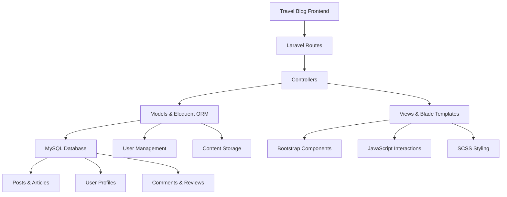

# 🌍 TourismBlog - Laravel Travel Platform

<div align="center">


**✈️ Discover the World Through Stories & Adventures**

[](https://laravel.com/)
[](https://php.net/)
[](https://mysql.com/)
[](https://getbootstrap.com/)


*"Every journey begins with a single step. Let's inspire your next adventure."*

</div>

---

## 🌟 Project Overview

**TourismBlog** is a comprehensive Laravel-powered travel platform that connects wanderers, adventurers, and travel enthusiasts from around the globe. This robust web application serves as a digital hub where travelers can share their experiences, discover hidden gems, plan their next adventures, and build a community around the passion for exploration.

### 🎯 **Mission & Vision**
- **Travel Inspiration**: Create a platform that inspires people to explore the world
- **Community Building**: Connect travelers and share authentic travel experiences
- **Cultural Exchange**: Promote understanding through travel stories and experiences
- **Sustainable Tourism**: Encourage responsible travel practices and local community support

---

## ✨ Platform Features

<table>
<tr>
<td width="33%" align="center">

### 📝 **Travel Blogging**


**Rich Content Creation**
- Interactive blog editor with media support
- Travel story categorization and tagging
- Photo galleries and video integration
- SEO-optimized content management
- Social media sharing capabilities

</td>
<td width="33%" align="center">

### 🗺️ **Destination Guides**


**Comprehensive Travel Information**
- Detailed destination profiles
- Travel tips and local insights  
- Weather and best travel times
- Transportation and accommodation guides
- Cultural etiquette and safety information

</td>
<td width="33%" align="center">

### 👥 **Travel Community**


**Social Travel Network**
- User profiles and travel portfolios
- Comment and review systems
- Travel buddy matching
- Experience sharing and recommendations
- Travel challenge participation

</td>
</tr>
</table>

### 🌍 **Advanced Platform Capabilities**

<details>
<summary><b>🔍 Comprehensive Feature Matrix</b></summary>

| Feature Category | Core Capabilities | User Experience | Admin Management |
|-----------------|-------------------|------------------|------------------|
| **📝 Content Management** | Rich text editor, multimedia support | Intuitive writing interface | Content moderation, publishing workflow |
| **🔍 Search & Discovery** | Advanced search, filtering, tagging | Personalized recommendations | Analytics, trending content |
| **👤 User Management** | Registration, profiles, authentication | Social features, follower system | User roles, permissions, moderation |
| **🗂️ Organization** | Categories, destinations, travel types | Easy navigation, bookmarking | Content organization, taxonomy management |
| **📊 Analytics** | User engagement, content performance | Reading statistics, progress tracking | Comprehensive reporting dashboard |
| **🌐 Internationalization** | Multi-language support, localization | Cultural customization | Regional content management |
| **📱 Responsive Design** | Mobile-first approach, PWA features | Seamless cross-device experience | Mobile content optimization |
| **🔒 Security** | User authentication, data protection | Privacy controls, secure sessions | Security monitoring, access control |

</details>

---

## 🛠️ Technical Architecture

<div align="center">

### Laravel MVC Architecture


</div>

### 🚀 **Technology Stack & Performance**

| Component | Technology | Purpose | Performance Benefits |
|-----------|------------|---------|---------------------|
| **🏗️ Framework** |  | Robust PHP web framework | MVC architecture, Eloquent ORM |
| **🗄️ Database** |  | Relational database management | Optimized queries, data integrity |
| **🎨 Frontend** |  | Responsive UI framework | Mobile-first design, component library |
| **💻 Language** |  | Server-side scripting | Modern PHP 8+ features |
| **🎭 Templates** |  | Laravel templating engine | Dynamic content, template inheritance |
| **📜 Scripts** |  | Client-side interactivity | Enhanced user experience |
| **🎨 Styling** |  | CSS preprocessor | Maintainable, modular styling |

### 🏗️ **Laravel Application Structure**

<table>
<tr>
<td width="50%">

#### **🔧 Backend Architecture**
- **MVC Pattern**: Clean separation of concerns with Models, Views, Controllers
- **Eloquent ORM**: Expressive database interactions with relationships
- **Middleware**: Authentication, security, and request filtering
- **Service Providers**: Dependency injection and service binding
- **Artisan Commands**: Custom CLI commands for maintenance tasks

</td>
<td width="50%">

#### **🎨 Frontend Integration**
- **Blade Components**: Reusable UI components and layouts
- **Asset Compilation**: Laravel Mix for CSS/JS bundling and optimization
- **Responsive Design**: Bootstrap-powered mobile-first interface
- **Progressive Enhancement**: JavaScript enhancements over solid HTML foundation
- **SEO Optimization**: Meta tags, structured data, and semantic markup

</td>
</tr>
</table>

---

## 📂 Project Structure

```
TourismBlog/
├── 🏗️ app/
│   ├── 🎯 Http/
│   │   ├── Controllers/
│   │   │   ├── HomeController.php              # Homepage and dashboard
│   │   │   ├── PostController.php              # Blog post management
│   │   │   ├── DestinationController.php       # Travel destination handling
│   │   │   ├── UserController.php              # User profile management
│   │   │   ├── CommentController.php           # Comment system
│   │   │   └── AdminController.php             # Administrative functions
│   │   ├── Middleware/
│   │   │   ├── Authenticate.php                # User authentication
│   │   │   ├── CheckRole.php                   # Role-based access control
│   │   │   └── TrackVisits.php                 # Analytics tracking
│   │   └── Requests/
│   │       ├── StorePostRequest.php            # Post creation validation
│   │       └── UpdateProfileRequest.php        # Profile update validation
│   ├── 📊 Models/
│   │   ├── User.php                            # User model with relationships
│   │   ├── Post.php                            # Blog post model
│   │   ├── Destination.php                     # Travel destination model
│   │   ├── Category.php                        # Content categorization
│   │   ├── Comment.php                         # Comment system model
│   │   ├── Tag.php                             # Tagging system
│   │   └── Media.php                           # File and image management
│   ├── 🔧 Services/
│   │   ├── BlogService.php                     # Blog business logic
│   │   ├── ImageUploadService.php              # Image processing service
│   │   ├── SEOService.php                      # Search engine optimization
│   │   └── NotificationService.php             # User notifications
│   └── 🛡️ Policies/
│       ├── PostPolicy.php                      # Post authorization rules
│       └── UserPolicy.php                      # User access permissions
├── 🗄️ database/
│   ├── migrations/
│   │   ├── create_users_table.php              # User database structure
│   │   ├── create_posts_table.php              # Blog posts table
│   │   ├── create_destinations_table.php       # Travel destinations
│   │   ├── create_categories_table.php         # Content categories
│   │   ├── create_comments_table.php           # Comment system
│   │   └── create_post_tag_table.php           # Many-to-many relationships
│   ├── seeders/
│   │   ├── UserSeeder.php                      # Sample user data
│   │   ├── PostSeeder.php                      # Demo blog content
│   │   ├── DestinationSeeder.php               # Travel destination samples
│   │   └── CategorySeeder.php                  # Content category seeds
│   └── factories/
│       ├── UserFactory.php                     # User data generation
│       └── PostFactory.php                     # Blog post generation
├── 🌐 resources/
│   ├── views/
│   │   ├── 🏠 layouts/
│   │   │   ├── app.blade.php                   # Main application layout
│   │   │   ├── admin.blade.php                 # Admin panel layout
│   │   │   └── auth.blade.php                  # Authentication layout
│   │   ├── 📝 posts/
│   │   │   ├── index.blade.php                 # Blog post listing
│   │   │   ├── show.blade.php                  # Single post view
│   │   │   ├── create.blade.php                # Post creation form
│   │   │   └── edit.blade.php                  # Post editing interface
│   │   ├── 🗺️ destinations/
│   │   │   ├── index.blade.php                 # Destination gallery
│   │   │   ├── show.blade.php                  # Destination details
│   │   │   └── guide.blade.php                 # Travel guide information
│   │   ├── 👤 users/
│   │   │   ├── profile.blade.php               # User profile page
│   │   │   ├── edit.blade.php                  # Profile editing
│   │   │   └── dashboard.blade.php             # User dashboard
│   │   └── 🔧 admin/
│   │       ├── dashboard.blade.php             # Admin control panel
│   │       ├── posts.blade.php                 # Content management
│   │       └── users.blade.php                 # User administration
│   ├── 🎨 scss/
│   │   ├── app.scss                            # Main stylesheet
│   │   ├── components/                         # UI component styles
│   │   ├── pages/                              # Page-specific styles
│   │   └── utilities/                          # Utility classes
│   └── 📜 js/
│       ├── app.js                              # Main JavaScript file
│       ├── components/                         # JavaScript components
│       └── pages/                              # Page-specific scripts
├── 🌐 routes/
│   ├── web.php                                 # Web application routes
│   ├── api.php                                 # API endpoints
│   └── admin.php                               # Administrative routes
├── 🧪 tests/
│   ├── Feature/                                # Integration tests
│   └── Unit/                                   # Unit tests
├── 📦 composer.json                            # PHP dependencies
├── 📦 package.json                             # Node.js dependencies
├── ⚙️ .env                                     # Environment configuration
└── 🚀 artisan                                  # Laravel command-line interface
```

---

## 🚀 Getting Started

### 📋 **Prerequisites & Requirements**

<details>
<summary><b>Development Environment Setup</b></summary>

```bash
# Required Software Stack
PHP 8.1+ with extensions:
  - OpenSSL
  - PDO
  - Mbstring  
  - Tokenizer
  - XML
  - Ctype
  - JSON
  - BCMath

Composer (PHP dependency manager)
Node.js 16+ and NPM
MySQL 8.0+ or PostgreSQL 13+
Git version control
```

**Recommended Development Tools:**
- **IDE**: VS Code with PHP Intelephense, Laravel Extension Pack
- **Database**: phpMyAdmin or MySQL Workbench
- **API Testing**: Postman or Insomnia
- **Version Control**: Git with GitKraken or SourceTree

</details>

### ⚡ **Installation Guide**

<details>
<summary><b>Click to expand step-by-step installation</b></summary>

1. **Clone the repository**
   ```bash
   git clone https://github.com/AmlanWTK/TourismBlog.git
   cd TourismBlog
   ```

2. **Install PHP dependencies**
   ```bash
   composer install
   ```

3. **Install Node.js dependencies**
   ```bash
   npm install
   ```

4. **Environment configuration**
   ```bash
   cp .env.example .env
   php artisan key:generate
   ```

5. **Database setup**
   ```bash
   # Create database in MySQL
   mysql -u root -p
   CREATE DATABASE tourism_blog;
   
   # Update .env file with database credentials
   DB_CONNECTION=mysql
   DB_HOST=127.0.0.1
   DB_PORT=3306
   DB_DATABASE=tourism_blog
   DB_USERNAME=your_username
   DB_PASSWORD=your_password
   ```

6. **Run migrations and seed data**
   ```bash
   php artisan migrate:fresh --seed
   ```

7. **Compile frontend assets**
   ```bash
   npm run dev
   ```

8. **Start development servers**
   ```bash
   # Terminal 1: Laravel server
   php artisan serve
   
   # Terminal 2: Asset compilation (watch mode)
   npm run watch
   ```

9. **Access the application**
   - **Frontend**: `http://localhost:8000`
   - **Admin Panel**: `http://localhost:8000/admin`
   - **API Documentation**: `http://localhost:8000/api/docs`

</details>

---

## 📝 Travel Blog Features

### ✍️ **Content Creation & Management**

<div align="center">

**Empowering travelers to share their stories with the world**

</div>

<table>
<tr>
<td width="50%">

#### **📝 Rich Editor Experience**
- **WYSIWYG Editor**: TinyMCE integration for rich text formatting
- **Media Library**: Drag-and-drop image and video uploads
- **Auto-Save**: Prevent content loss with automatic drafting
- **SEO Tools**: Built-in meta description and keyword optimization
- **Publishing Workflow**: Draft, review, and scheduled publishing

</td>
<td width="50%">

#### **🏷️ Content Organization**
- **Category System**: Organize posts by travel type, region, activity
- **Tag Management**: Flexible tagging for improved discoverability
- **Series Support**: Multi-part travel stories and itineraries
- **Featured Content**: Highlight exceptional travel experiences
- **Archive System**: Chronological and categorical content browsing

</td>
</tr>
</table>

### 🗺️ **Destination Discovery System**

<details>
<summary><b>🔍 Advanced Travel Planning Features</b></summary>

#### **📍 Destination Profiles**
- **Comprehensive Information**: Climate, culture, attractions, cuisine
- **Visual Galleries**: High-resolution photos and video tours
- **Travel Seasons**: Best times to visit with weather patterns
- **Budget Guidelines**: Cost estimates for different travel styles
- **Safety Information**: Current travel advisories and health requirements

#### **🎯 Personalized Recommendations**
- **Interest-Based Matching**: Recommendations based on user preferences
- **Similar Destinations**: Discover places with comparable experiences
- **Hidden Gems**: Lesser-known destinations curated by community
- **Trending Destinations**: Popular destinations based on recent posts
- **Wishlist Management**: Save and organize dream destinations

#### **📱 Travel Planning Tools**
- **Itinerary Builder**: Create and share detailed travel plans
- **Expense Tracker**: Budget planning and cost estimation tools
- **Packing Lists**: Destination-specific packing recommendations
- **Travel Checklist**: Pre-departure and during-travel task management
- **Weather Integration**: Real-time weather data and forecasts

</details>

---

## 👥 Community & Social Features

### 🤝 **Building Connections Through Travel**

<div align="center">

**"Travel is better when shared with like-minded adventurers"**

</div>

<table>
<tr>
<td width="25%" align="center">

**👤 User Profiles**
*Comprehensive traveler portfolios with trip history and achievements*

</td>
<td width="25%" align="center">

**💬 Interactive Comments**
*Engaging discussions on travel experiences and recommendations*

</td>
<td width="25%" align="center">

**⭐ Review System**
*Authentic reviews and ratings for destinations and experiences*

</td>
<td width="25%" align="center">

**🏆 Travel Challenges**
*Community challenges and achievement badges for exploration*

</td>
</tr>
</table>

### 📊 **Community Analytics & Insights**

<details>
<summary><b>📈 User Engagement Metrics</b></summary>

#### **🎯 User Activity Tracking**
- **Reading Analytics**: Track popular content and user engagement
- **Contribution Metrics**: Monitor user-generated content and participation
- **Travel Statistics**: Personal travel maps and achievement tracking
- **Community Impact**: Influence scores and helpful contribution recognition
- **Growth Metrics**: Platform usage and community expansion analytics

#### **🌍 Travel Insights Dashboard**
- **Popular Destinations**: Trending locations based on community activity
- **Seasonal Trends**: Travel pattern analysis and seasonal recommendations
- **User Demographics**: Community composition and geographic distribution
- **Content Performance**: Most engaging posts and successful content strategies
- **Emerging Destinations**: Up-and-coming travel hotspots identified by community

</details>

---

## 🔐 Security & Performance

### 🛡️ **Laravel Security Framework**

<div align="center">

**"Security is not a feature, it's a foundation"**

</div>

<table>
<tr>
<td width="50%">

#### **🔒 Authentication & Authorization**
- **Laravel Sanctum**: API token authentication for secure access
- **Role-Based Permissions**: Admin, moderator, and user role hierarchy
- **Two-Factor Authentication**: Optional 2FA for enhanced account security
- **Social Login**: OAuth integration with Google, Facebook, Twitter
- **Password Security**: Encrypted storage with strength requirements

</td>
<td width="50%">

#### **⚡ Performance Optimization**
- **Laravel Caching**: Redis/Memcached for improved response times
- **Database Optimization**: Query optimization and indexing strategies
- **CDN Integration**: Asset delivery through content distribution networks
- **Image Optimization**: Automatic resizing and format conversion
- **Lazy Loading**: Efficient content loading for improved user experience

</td>
</tr>
</table>

### 📊 **Technical Performance Metrics**

<details>
<summary><b>🔍 Performance Benchmarks</b></summary>

#### **⚡ Speed & Efficiency**
- **Page Load Time**: <2 seconds average load time on standard hosting
- **Database Queries**: Optimized with eager loading and query caching  
- **Memory Usage**: Efficient memory management with Laravel's service container
- **Concurrent Users**: Supports 1000+ concurrent users with proper hosting
- **Mobile Performance**: 95+ PageSpeed Insights score for mobile experience

#### **🚀 Scalability Features**
- **Horizontal Scaling**: Database sharding and load balancing support
- **Microservices Ready**: Modular architecture for service separation
- **API-First Design**: RESTful API for mobile apps and third-party integration
- **Queue Processing**: Background job processing for heavy operations
- **Event Broadcasting**: Real-time features using WebSocket connections

</details>

---

## 🤝 Contributing & Development

<div align="center">

**Join our community of developers building the future of travel technology**

[](CONTRIBUTING.md)
[](https://discord.gg/tourism-blog)

</div>

### 🛠️ **Development Areas**

<table>
<tr>
<td width="25%" align="center">

#### **🏗️ Backend Development**
- Laravel feature development
- Database optimization
- API endpoint creation
- Security enhancements
- Performance improvements

</td>
<td width="25%" align="center">

#### **🎨 Frontend Development**
- Responsive UI components
- JavaScript functionality
- SCSS styling improvements
- User experience optimization
- Accessibility enhancements

</td>
<td width="25%" align="center">

#### **📊 Data & Analytics**
- Travel data analysis
- User behavior insights
- Recommendation algorithms
- Performance monitoring
- SEO optimization

</td>
<td width="25%" align="center">

#### **🌍 Content & Community**
- Travel content creation
- Destination research
- Community moderation
- User onboarding
- Content quality assurance

</td>
</tr>
</table>

### 🔄 **Contribution Workflow**

1. 🍴 **Fork** the repository
2. 🌿 **Create** a feature branch (`git checkout -b feature/travel-enhancement`)
3. 💍 **Commit** changes (`git commit -m 'Add travel planning feature'`)
4. 📤 **Push** to branch (`git push origin feature/travel-enhancement`)
5. 🎯 **Open** Pull Request with detailed description and testing notes

---

## 🏆 Platform Recognition & Impact

### 🌍 **Travel Industry Statistics**

<div align="center">

| Global Tourism Metric | Statistics | Platform Opportunity |
|----------------------|------------|---------------------|
| **Annual Travelers** | 1.4B international tourists | Travel story sharing platform |
| **Travel Blog Readers** | 76% research online before traveling | Authentic experience sharing |
| **User-Generated Content** | 85% trust peer reviews | Community-driven recommendations |
| **Mobile Travel Planning** | 70% plan trips on mobile devices | Mobile-optimized travel platform |

*Source: UNWTO Tourism Statistics, 2024*

</div>

### 🎯 **Platform Impact Goals**

- **🌍 Global Community**: Connect travelers from 100+ countries
- **📝 Content Creation**: Host 10,000+ authentic travel stories
- **🗺️ Destination Coverage**: Comprehensive guides for 1,000+ destinations  
- **🤝 Community Building**: Facilitate 50,000+ travel connections
- **🌱 Sustainable Tourism**: Promote responsible travel practices

---

## 📄 License & Usage

<div align="center">

[](https://opensource.org/licenses/MIT)

**MIT License © 2025 TourismBlog Platform**

</div>

### 📋 **Usage Guidelines**

- ✅ **Personal Travel Blogs**: Free for individual travel enthusiasts and bloggers
- ✅ **Community Platforms**: Encouraged for travel communities and organizations
- ✅ **Educational Projects**: Perfect for learning Laravel and web development
- ✅ **Commercial Development**: Open source foundation for travel businesses
- ⚖️ **Attribution Required**: Credit original developers in derivative works

---

## 🔗 Resources & Support

<div align="center">

| Resource | Link | Description |
|----------|------|-------------|
| 🌐 **Live Demo** | [Visit Platform](#) | Interactive platform demonstration |
| 📚 **Documentation** | [Developer Guide](https://github.com/AmlanWTK/TourismBlog/wiki) | Technical documentation |
| 💬 **Community** | [Discord Server](https://discord.gg/tourism-blog) | Developer discussions |
| 🐛 **Issues** | [GitHub Issues](https://github.com/AmlanWTK/TourismBlog/issues) | Bug reports & features |
| 📧 **Support** | [Contact Us](mailto:support@example.com) | Technical support |
| 🎓 **Laravel** | [Laravel Documentation](https://laravel.com/docs) | Framework documentation |

[](https://github.com/AmlanWTK/TourismBlog)
[](https://github.com/AmlanWTK/TourismBlog)

</div>

---

## 💭 Travel Philosophy

<div align="center">

> *"The world is a book, and those who do not travel read only one page."*  
> **- Saint Augustine**

> *"Travel makes one modest. You see what a tiny place you occupy in the world."*  
> **- Gustave Flaubert**

> *"Not all those who wander are lost."*  
> **- J.R.R. Tolkien**

---

### ✈️ **Start Your Travel Journey Today**

**[🚀 Get Started](#-getting-started) • [🌍 Explore Demo](#) • [🤝 Join Community](https://discord.gg/tourism-blog)**

---

*Built with ❤️ for travelers worldwide and powered by Laravel excellence*

**⭐ Star this repository to support the global travel community!**

### 🆘 Travel Support Resources

**For travel emergencies and support:**
- **🌍 International SOS**: Global travel assistance and emergency services
- **🏥 Travel Insurance**: Comprehensive coverage for international travel
- **📞 Embassy Services**: Contact your local embassy while abroad
- **🚨 Emergency**: Call local emergency services (911, 112, etc.)

*This platform provides travel information but travelers should always verify current conditions and requirements.*

</div>
